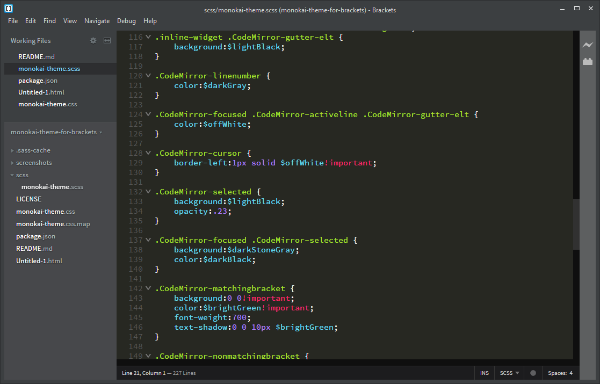
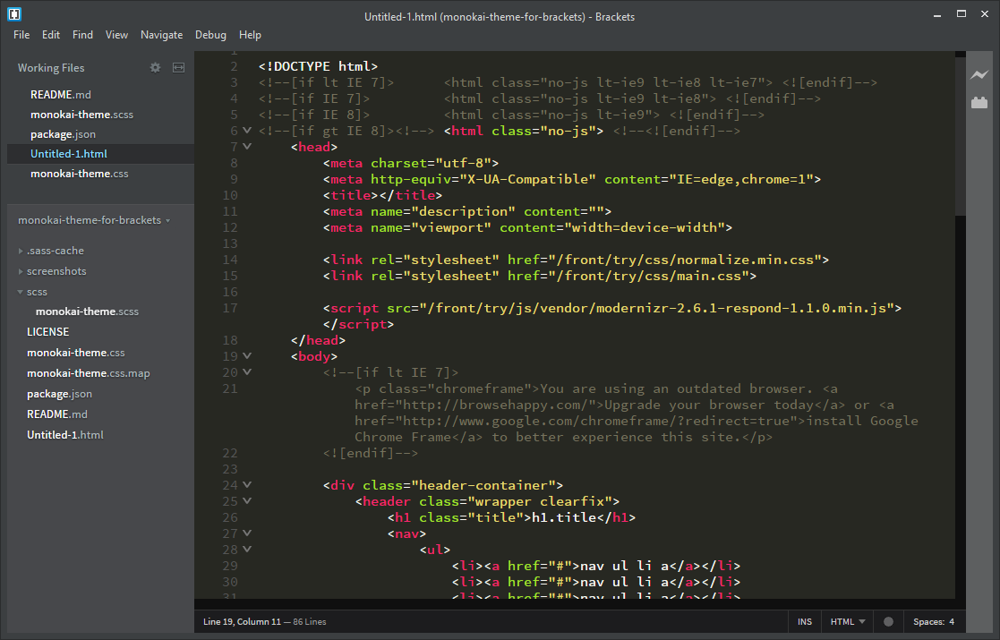
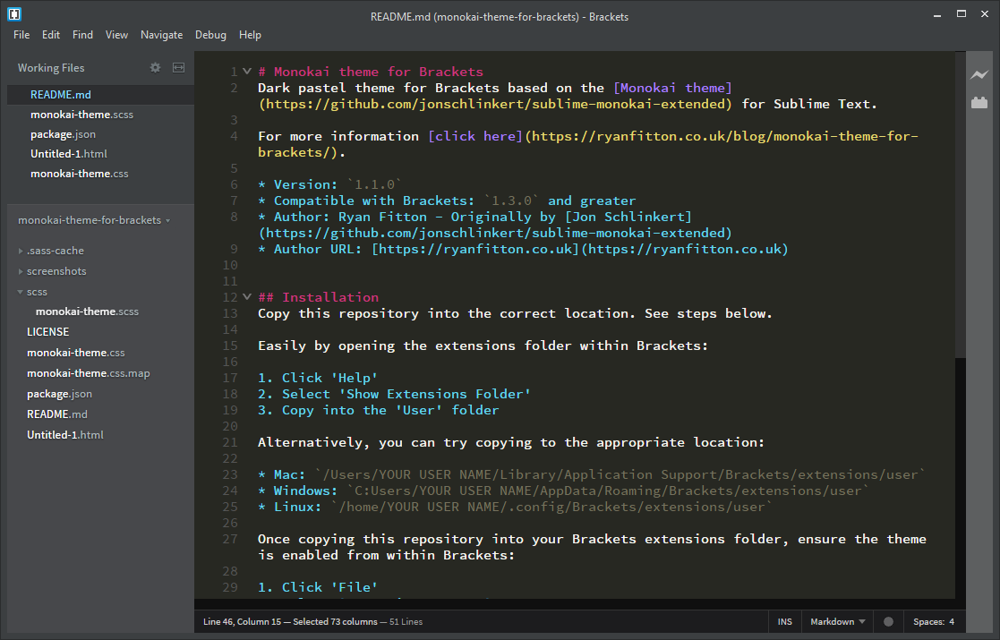

# Monokai theme for Brackets
Dark pastel theme for Brackets based on the [Monokai theme](https://github.com/jonschlinkert/sublime-monokai-extended) for Sublime Text.

For more information [click here](https://ryanfitton.co.uk/blog/monokai-theme-for-brackets/).

* Version: `1.1.0`
* Compatible with Brackets: `1.3.0` and greater
* Author: Ryan Fitton - Originally by [Jon Schlinkert](https://github.com/jonschlinkert/sublime-monokai-extended)
* Author URL: [https://ryanfitton.co.uk](https://ryanfitton.co.uk)

## Installation
Copy this repository into the correct location. See steps below.

Easily by opening the extensions folder within Brackets:

1. Click 'Help'
2. Select 'Show Extensions Folder'
3. Copy into the 'User' folder

Alternatively, you can try copying to the appropriate location:

* Mac: `/Users/YOUR USER NAME/Library/Application Support/Brackets/extensions/user`
* Windows: `C:Users/YOUR USER NAME/AppData/Roaming/Brackets/extensions/user`
* Linux: `/home/YOUR USER NAME/.config/Brackets/extensions/user`

Once copying this repository into your Brackets extensions folder, ensure the theme is enabled from within Brackets:

1. Click 'File'
2. Select 'Extension Manager'
3. Browse the 'Installed' tab
4. Click enable for the theme named 'Monokai theme for Brackets'

## Screenshots
**CSS styling:**

**HTML styling:**

**Markdown styling:**

## SASS (SCSS) file compiling
SASS (SCSS) is used to reduce the effort for updating and managing CSS.

Compile to the root of this repository:

* `/scss/monokai-theme.scss` - Compile to: `/monokai-theme.css`

To compile .scss files, Ruby must be installed. Install Ruby for Windows with this [installer](https://rubyinstaller.org/) then install the SASS Ruby GEM by running `gem install sass`.

Once installed, you can start compiling your scss files into css with these commands:

* style.css: `sass --watch scss/monokai-theme.scss:monokai-theme.css --style compressed`

## License
Copyright © 2017, [Ryan Fitton](https://ryanfitton.co.uk). Released under the [MIT license](LICENSE).